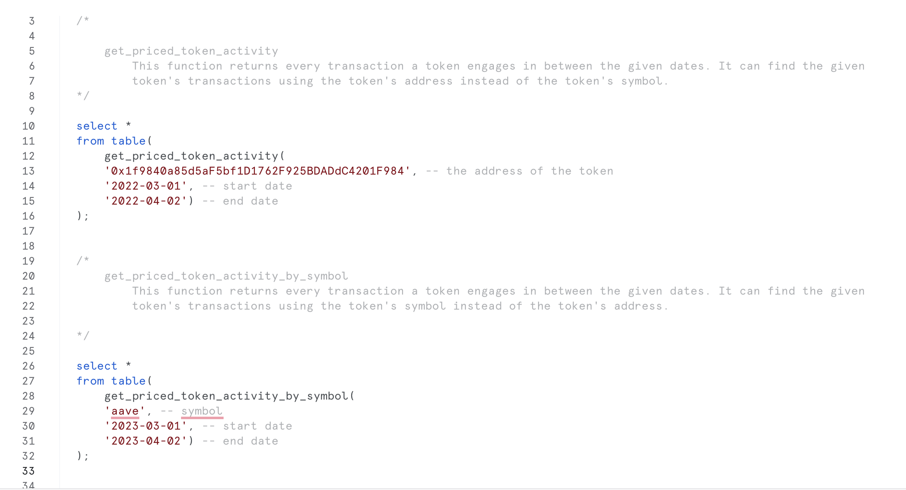
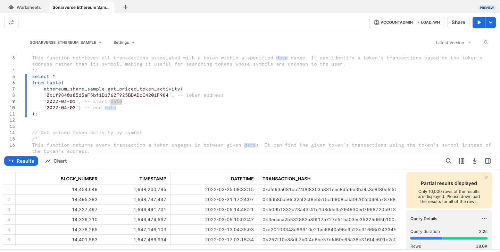
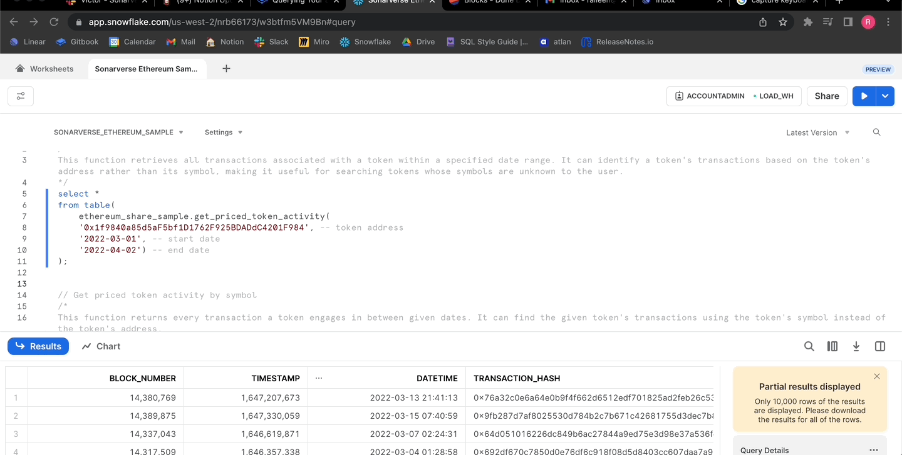
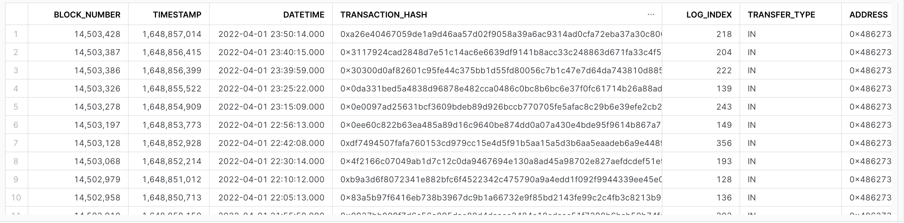

# Querying Your Data

**There are some custom-built functions included in your Snowflake data share worksheet.**

After gaining access to your data share, you should see a worksheet like this:

You can run the provided queries in one of two ways:

1. Highlight the entire query and press the blue play button.

2. Place your text cursor at any space in the function. Use the keyboard shortcut **Ctrl(CMD) + Enter** to run the query.

If the run is successful, your query should return results similar to the ones below:

For more details on the columns, visit our EVM Datasets page to find all of the definitions.

## Next steps

- Explore our EVM Function Master list.
- Arew e missing a term? Send us an email at onboarding@sonarverse.com